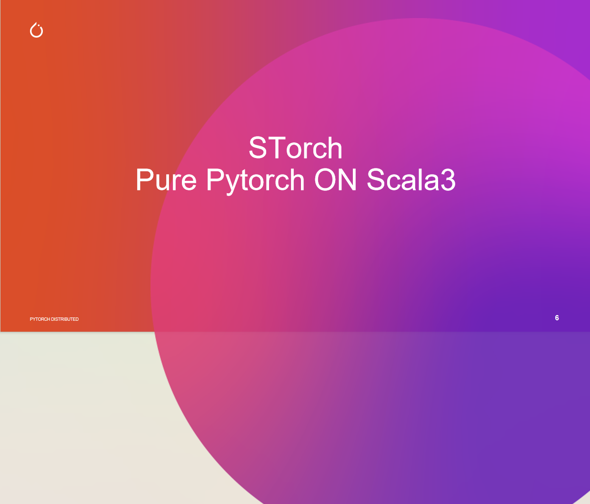
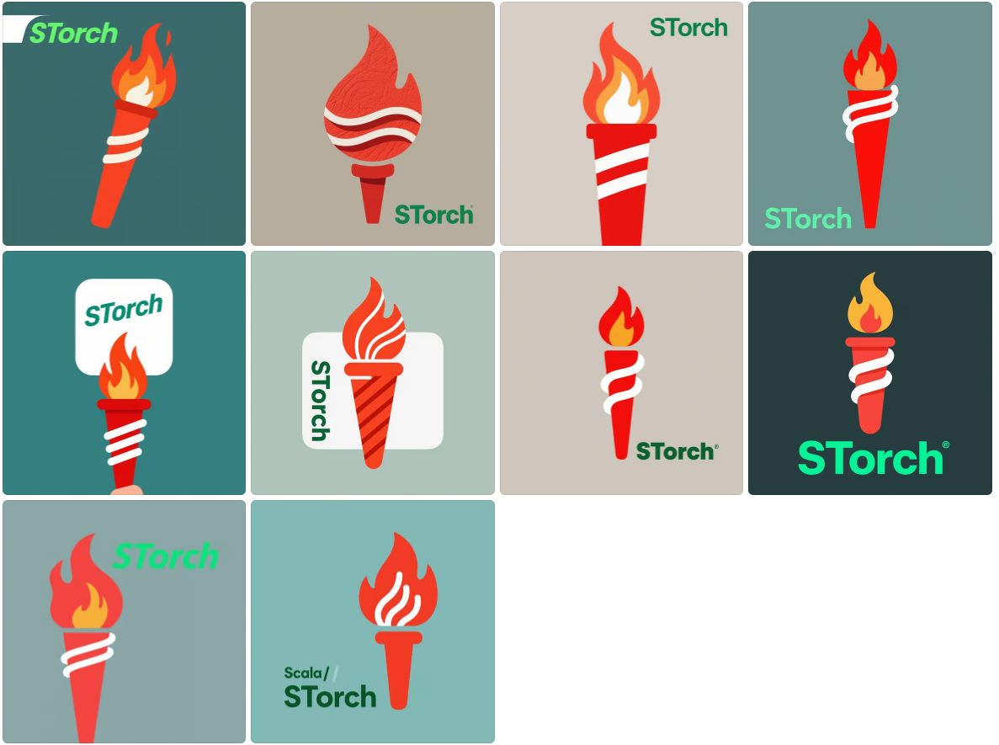

# .                        🎖️ PyTorch ON Scala3 Tutorial Lesson ! 🎖️

#  Build Powerful AI Infrastructure for Scala 3 🌟🌟🌟🌟
# .                        🎖️ AI Infra 3.0 ON Scala3 ! 🎖️
# STorch AI - 🌟🌟🌟🌟 GPU Accelerated Distributeed Deep Learning && LLM && RL for Scala 3 🌟🌟🌟🌟

## 🎖️🎖️🎖️PyTorch ON Scala3 Lesson => 
    You will learn:

### 🌟🌟Lesson 01 How to create Tensor and numpy NDArray
### 🌟🌟lesson 02 Tensor operate
### 🌟🌟lesson 03 Tensor autograd and backward
### 🌟🌟lesson 04 How to use torch layer loss function and activation 
### 🌟🌟lesson 05 How to use TensorDataset and DataLoader
### 🌟🌟lesson 06 How to use Optimizer and training circle
### 🌟🌟lesson 07 ow to training the torch model 
### 🌟🌟lesson 08 How to control the training and check the error
### 🌟🌟lesson 09 Pytorch Inner Autograd 
### 🌟🌟lesson 10 How to use Transformer and Attention
### 🌟🌟lesson 11 How to optimize the model and training strategy
### 🌟🌟lesson 12 How to deploy the model
### 🌟🌟lesson 13 How to make distribute training the model
### 🌟🌟lesson 14 How to create Optimizer by self


## STorch is a Scala library for fast tensor computations and deep learning, same as PyTorch.

### Like PyTorch, STorch provides 📇 🏠 🪟 🍎 🐧
* Both Compile from Cpp LibTorch, STorch has Same Equal Position with Pytorch
* A NumPy like API for working with tensors
* GPU support [Future will support HuaWei CANN NPU]
* Automatic differentiation on Linux | Mac | Windows | IOS | Andriod
* A neural network API for building and training neural networks.
* What All you need Pytorch features could find in STorch !!!
* Minimal time and learning cost migrate from python pytorch developer
* Maximal ROI for Big Data developer and Data Scientist
* Support LLM | Recommend System | Compute Vision | NLP | Financial Tech | RL |Big Data | Data Science Research
* Big Deep Learning Environment Chains boost you concentrate on  development
* Support Java SMID Vector API, Please use JDK Version >= 17
* Could Use NCCL | GLOO | RAY | SPARK | FLINK for DISTRIBUTE TRAINING and inference [Future will support UCC | MPI]
* Best Data Driven Process and Monad Feature Engineer Model Pipeline Partner for Apache Spark | Flink  | Polar

STorch aims to close to the Python API to make porting existing models and the life of people already familiar with PyTorch easier.


### STorch LLM -> Scala3gpt-llm is ready to use Pure Pytorch Neural Network for Scala 3 ON LLM


### How to fetch STorch Library [Extended Version]
```scala 3

libraryDependencies +=   "io.github.mullerhai" % "storch_core_3" % "0.7.3-1.15.2"

## STorch GPU Adapter
libraryDependencies +=   "io.github.mullerhai" % "storch-gpu-adapter_3" % "0.1.3-1.5.12"

//libraryDependencies += "org.bytedeco" % "cuda-platform-redist" % "12.9-9.10-1.5.12"

```


# STorch AI Family:
## STorch Numpy
## STorch Pandas
## STorch Tensorboard
## STorch OpenCV
## STorch Ffmpeg
## STorch Librosa
## STorch Spark
## STorch Flink
## STroch Cuda
## STorch TensorRT
## STorch Triton
## STorch Transformers
## Storch Multinmodel
## STorch RL
## STorch Data
## STorch Graph
## STorch Geometric
## STorch Peft
## STorch Vision
## STorch Text
## STorch Audio
## STorch Jieba
## STorch Recommend
## STorch Finance
## STorch Drug
## STorch LLM
## STorch Faiss
## STorch Milvus
## STorch CSV | Pickle | Hdf5 | Parquet | Orc | Avro | Json | Xml | Sql | Hive | Kafka | Redis | Mysql | Postgres | Sqlite | Clickhouse | MongoDB | Cassandra | Redis | Kafka | RabbitMQ | Celery | Polars | Scikit-learn | TensorRT | Triton | Transformers | NLP | Computer Vision | Recommend System | Financial Tech | RL | Big Data | Data Science Research


### How to learn STorch
## STorch Tutorial 


For documentation, see https://storch.dev

## Example:

```scala
val data = Seq(0,1,2,3)
// data: Seq[Int] = List(0, 1, 2, 3)
val t1 = torch.Tensor(data)
// t1: Tensor[Int32] = dtype=int32, shape=[4], device=CPU 
// [0, 1, 2, 3]
t1.equal(torch.arange(0,4))
// res0: Boolean = true
val t2 = t1.to(dtype=float32)
// t2: Tensor[Float32] = dtype=float32, shape=[4], device=CPU 
// [0,0000, 1,0000, 2,0000, 3,0000]
val t3 = t1 + t2
// t3: Tensor[Float32] = dtype=float32, shape=[4], device=CPU 
// [0,0000, 2,0000, 4,0000, 6,0000]

val shape = Seq(2l,3l)
// shape: Seq[Long] = List(2, 3)
val randTensor = torch.rand(shape)
// randTensor: Tensor[Float32] = dtype=float32, shape=[2, 3], device=CPU 
// [[0,4341, 0,9738, 0,9305],
//  [0,8987, 0,1122, 0,3912]]
val zerosTensor = torch.zeros(shape, dtype=torch.int64)
// zerosTensor: Tensor[Int64] = dtype=int64, shape=[2, 3], device=CPU 
// [[0, 0, 0],
//  [0, 0, 0]]

val x = torch.ones(Seq(5))
// x: Tensor[Float32] = dtype=float32, shape=[5], device=CPU 
// [1,0000, 1,0000, 1,0000, 1,0000, 1,0000]
val w = torch.randn(Seq(5, 3), requiresGrad=true)
// w: Tensor[Float32] = dtype=float32, shape=[5, 3], device=CPU 
// [[0,8975, 0,5484, 0,2307],
//  [0,2689, 0,7430, 0,6446],
//  [0,9503, 0,6342, 0,7523],
//  [0,5332, 0,7497, 0,3665],
//  [0,3376, 0,6040, 0,5033]]
val b = torch.randn(Seq(3), requiresGrad=true)
// b: Tensor[Float32] = dtype=float32, shape=[3], device=CPU 
// [0,2638, 0,9697, 0,3664]
val z = (x matmul w) + b
// z: Tensor[Float32] = dtype=float32, shape=[3], device=CPU 
// [3,2513, 4,2490, 2,8640]
```


## STorch Build LLM

```scala 3

package moe

import torch.{Float32,Int64,Int32, *}
import torch.nn.*
import torch.nn.functional as F
import torch.nn.modules.{HasParams, TensorModule}
import torch.optim.{Adam, Optimizer}

import scala.util.Random

 set random seed 
Random.setSeed(1024)
torch.manualSeed(1024)


class BasicExpert[ParamType <: FloatNN: Default](featureIn: Int, featureOut: Int) extends HasParams[ParamType]
with TensorModule[ParamType]  {
  val linear = register(nn.Linear(featureIn, featureOut))
  def apply(x: Tensor[ParamType]): Tensor[ParamType] = {
    linear.forward(x)
  }
  def forward(x: Tensor[ParamType]): Tensor[ParamType] = {
    linear.forward(x)
  }
}

 
class BasicMOE[ParamType <: FloatNN: Default](featureIn: Int, featureOut: Int, expertNumber: Int) extends HasParams[ParamType]
  with TensorModule[ParamType]  {
  val experts = nn.ModuleList((0 until expertNumber).map(num => new BasicExpert(featureIn, featureOut))*)
  val gate = register(Linear(featureIn, expertNumber))
  override def apply(v1: Tensor[ParamType]): Tensor[ParamType] = ???
  def forward(x: Tensor[ParamType]): Tensor[ParamType] = {
    // x 的形状是 (batch, featureIn)
    val expertWeight = gate.forward(x)  // 形状是 (batch, expertNumber)
    // 计算每个专家的输出并增加一个维度
    val expertOutList = experts.map(expert => expert(x).unsqueeze(1))
    // 拼接专家输出，形状变为 (batch, expertNumber, featureOut)
    val expertOutput = torch.cat(expertOutList.toSeq, dim = 1)
    // 调整权重形状以进行矩阵乘法
    val reshapedWeight = expertWeight.unsqueeze(1)  // (batch, 1, expertNumber)

    // 矩阵乘法计算最终输出
    val output = reshapedWeight.matmul(expertOutput)  // (batch, 1, featureOut)

    // 移除多余的维度
    output.squeeze()
  }
}

 test BasicMOE
object TestBasicMOE {
  def apply(): Unit = {
    val x = torch.rand(Seq(2, 4))
    val basicMoe = BasicMOE(4, 3, 2)
    val out = basicMoe.forward(x)
    println(out)
  }
}

 MOE Router
class MOERouter[ParamType <: FloatNN: Default](hiddenDim: Int, expertNumber: Int, topK: Int) extends HasParams[ParamType]
  with TensorModule[ParamType]  {
  val gate = register(nn.Linear(hiddenDim, expertNumber))
  override def apply(v1: Tensor[ParamType]): Tensor[ParamType] = ???
  def forward(hiddenStates: Tensor[ParamType]): (Tensor[ParamType], Tensor[ParamType], Tensor[Int64], Tensor[ParamType]) = {
    // 计算路由logits
    val routerLogits = gate.forward(hiddenStates)  // 形状是 (b * s, expertNumber)
    // 计算专家经过softmax之后的概率
    val routingProbs = F.softmax(routerLogits, dim = -1, dtype = hiddenStates.dtype)
    // 计算topk的专家的输出
    val routerWeights_selectedExperts = torch.topk(routingProbs, topK, dim = -1) //, largest = true, sorted = true
    val (routerWeights, selectedExperts) = (routerWeights_selectedExperts._1,routerWeights_selectedExperts._2)
    // 专家权重归一化
    val normalizedWeights = routerWeights / routerWeights.sum(dim = -1, keepdim = true)
    val routerWeightsTyped = normalizedWeights.to(hiddenStates.dtype)
    // 生成专家掩码
    val expertMask = F.one_hot(selectedExperts, numClasses = expertNumber)
    val permutedMask = expertMask.permute(2, 1, 0).to(hiddenStates.dtype)
    (routerLogits, routerWeightsTyped, selectedExperts, permutedMask)
  }
}

 MOE Router Config
case class MOEConfig(
    hiddenDim: Int,
    expertNumber: Int,
    topK: Int,
    sharedExpertsNumber: Int = 2
)

 Sparse MOE Model
class SparseMOE[ParamType <: FloatNN: Default](config: MOEConfig) extends HasParams[ParamType]
  with TensorModule[ParamType] {
  val hiddenDim: Int = config.hiddenDim
  val expertNumber: Int = config.expertNumber
  val topK: Int = config.topK
  val experts = nn.ModuleList( (0 until expertNumber).map(num => new BasicExpert(hiddenDim, hiddenDim))* )
  val router = MOERouter(hiddenDim, expertNumber, topK)
  override def apply(v1: Tensor[ParamType]): Tensor[ParamType] = ???
  def forward(x: Tensor[ParamType]): (Tensor[ParamType], Tensor[ParamType]) = {
    // x 形状是 (b, s, hiddenDim)
    val batchSize = x.shape(0).toInt
    val seqLen = x.shape(1).toInt
    // 合并前两个维度，因为不是Sample维度了，而是token维度
    val hiddenStates = x.view(-1, hiddenDim) // 形状是(b * s, hiddenDim)
    val (routerLogits, routerWeights, selectedExpertsIndices, expertMask) = 
      router.forward(hiddenStates)
    // 创建输出张量
    val finalHiddenStates = torch.zeros(
      Seq(batchSize * seqLen, hiddenDim),
      dtype = hiddenStates.dtype,
      device = hiddenStates.device
    )
    // 对每个专家进行处理
//    hiddenStates.toArray
    for (expertIdx <- 0 until expertNumber) {
      val expertLayer = experts(expertIdx)
      // 获取当前专家的掩码并找到需要处理的token
      val idx_topx = torch.where(expertMask(expertIdx))
      val idx = idx_topx(0)
      val topX: Tensor[ParamType] = idx_topx(1)
//      topX.numpy().toArray
//      val (idx, topX) = torch.where(expertMask(expertIdx))
      val hiddenStateUnsqueezed = hiddenStates.unsqueeze(0)
      // 提取需要处理的token的隐藏状态
//      val currentState = hiddenStateUnsqueezed(::,topX.toArray.toSeq.asInstanceOf[Seq[Long]], ::).reshape(-1, hiddenDim)
      val currentState = hiddenStateUnsqueezed(::, topX.to(DType.int64), ::).reshape(-1, hiddenDim)
      // 应用专家层并加权
      val weights = routerWeights(topX.to(DType.int64), idx.to(DType.int64)).unsqueeze(-1)
      val currentHiddenStates = expertLayer(currentState) * weights

      // 将当前专家的输出加到最终结果中
      finalHiddenStates.index_add_(0, topX.to(DType.int64), currentHiddenStates.to(hiddenStates.dtype))
    }
    // 将结果还原到原始形状
    val reshapedOutput = finalHiddenStates.reshape(batchSize, seqLen, hiddenDim)

    (reshapedOutput, routerLogits)
  }
}


            current_state = hidden_states.unsqueeze(
                0
            )[:, top_x, :].reshape(-1, hidden_dim) # （selected_token_number, hidden_dim）

            # router_weight 的 shape 是 (b * s, top_k)
            current_hidden_states = expert_layer(
                current_state
            ) * router_weights[top_x, idx].unsqueeze(-1)  # （selected_token_number, 1） 这里有广播

 test Sparse MOE model
object TestTokenLevelMOE {
  def apply(): Unit = {
    val x = torch.rand(Seq(2, 4, 16))
    val config = MOEConfig(16, 2, 2)
    val tokenLevelMoe = SparseMOE(config)
    val (out, logits) = tokenLevelMoe.forward(x)
    println(s"Output shape: ${out.shape}, Router logits shape: ${logits.shape}")
  }
}

 Share expert's Sparse MOE model
class ShareExpertMOE[ParamType <: FloatNN: Default](config: MOEConfig) extends HasParams[ParamType]
  with TensorModule[ParamType] {
  val moeModel = SparseMOE(config)
  val sharedExperts = nn.ModuleList(
    (0 until config.sharedExpertsNumber).map(num => BasicExpert(config.hiddenDim, config.hiddenDim))*
  )
  override def apply(v1: Tensor[ParamType]): Tensor[ParamType] = ???
  def forward(x: Tensor[ParamType]): (Tensor[ParamType], Tensor[ParamType]) = {
    // 首先通过moe模型
    val (sparseMoeOut, routerLogits) = moeModel.forward(x)

    // 然后通过共享专家
    val sharedExpertsOut = sharedExperts.map(expert => expert(x))

    // 堆叠共享专家的输出并求和
    val sharedExpertsOutSum = torch.stack(sharedExpertsOut.toSeq, dim = 0).sum(dim = 0)

    // 将sparse_moe_out和shared_experts_out相加
    (sparseMoeOut + sharedExpertsOutSum, routerLogits)
  }
}

 test share expert's Sparse MOE model
object TestShareExpertMOE {
  def apply(): Unit = {
    val x = torch.rand(Seq(2, 4, 16))
    val config = MOEConfig(16, 2, 2)
    val shareExpertMoe = ShareExpertMOE(config)
    val (out, logits) = shareExpertMoe.forward(x)
    println(s"Output shape: ${out.shape}, Router logits shape: ${logits.shape}")
  }
}

// compute Switch Transformers's load balancing loss
def switchLoadBalancingLoss[ParamType <: FloatNN: Default](routerLogits: Tensor[ParamType], numExperts: Int): Tensor[Float32] = {
  // 计算路由概率
  val routerProbs = torch.softmax(routerLogits, dim = -1)  // [b*s, numExperts]

  // 获取每个token的最优专家
  val anySelectedExperts = torch.topk(routerProbs, k = 2, dim = -1, largest = true, sorted = true)  // [b*s]

  // 创建one-hot矩阵表示选中的专家
  val mask = F.one_hot(anySelectedExperts._2.to(DType.int64), numExperts).float()  // [b*s, numExperts]

  // 计算每个专家的期望负载 (理想情况下应该是 1/numExperts)
  val expectedLoad = torch.onesLike(routerProbs) / numExperts

  // 计算实际负载 (每个专家处理的token数量除以总token数量)
  // 在batch维度上计算平均值
  val actualLoad = mask.mean(dim = 0)  // [numExperts]

  // 计算auxiliary loss
  // 这会惩罚负载分布与期望负载的差异
  val auxLoss = torch.sum(actualLoad * routerProbs.mean(dim = 0)) * numExperts

  // 计算z_loss (可选)
  // 这会惩罚过大的路由logits
  val zLoss = torch.mean(torch.square(routerLogits))
  val zLossWeight = 0.001f  // 可调整的超参数

  // 总损失
  val totalLoss = auxLoss + zLoss * zLossWeight

  totalLoss.to(torch.float32)
}

// test MOE training 
object TestMOETraining {
  def apply(): Unit = {
    // 创建简单的数据集参数
    val batchSize = 32
    val seqLen = 16
    val hiddenDim = 32
    val numBatches = 100

    // 初始化模型和优化器
    val config = MOEConfig(
      hiddenDim = hiddenDim,
      expertNumber = 4,
      topK = 2,
      sharedExpertsNumber = 2
    )

    val model = ShareExpertMOE(config)
    val optimizer = Adam(model.parameters(true), lr = 0.001f)

    // 训练循环
    model.train()
    for (batch <- 0 until numBatches) {
      // 生成随机输入数据
      val x = torch.randn(Seq(batchSize, seqLen, hiddenDim))
      val target = torch.randn(Seq(batchSize, seqLen, hiddenDim))

      // 前向传播
      val (output, routerLogits) = model.forward(x)

      // 计算损失
      // 预测的MSE损失
      val mseLoss = F.mse_loss(output, target)

      val auxLoss = switchLoadBalancingLoss(routerLogits, config.expertNumber)
      // 组合损失
      val totalLoss = mseLoss + 0.01f * auxLoss

      // 反向传播和优化
      optimizer.zeroGrad()
      totalLoss.backward()
      optimizer.step()

      if (batch % 10 == 0) {
        println(f"Batch $batch, Loss: ${totalLoss.item} " +
                f"(MSE: ${mseLoss.item}, Aux: ${auxLoss.item})")
      }
    }
  }
}

// run all tests
object MOETests {
  def main(args: Array[String]): Unit = {
    println("Testing Basic MOE:")
    TestBasicMOE()

    println("\nTesting Token Level MOE:")
    TestTokenLevelMOE()

    println("\nTesting Share Expert MOE:")
    TestShareExpertMOE()

    println("\nTesting MOE Training:")
    TestMOETraining()
  }
}


```





